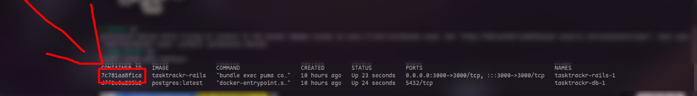

# 📃 TaskTrackr

TaskTrackr é uma aplicação projetada para ajudar você a organizar suas tarefas e melhorar sua produtividade. Com sua interface intuitiva e recursos poderosos, o TaskTrackr torna a gestão de tarefas fácil.

## 📍 Tecnologias

O TaskTrackr é construído utilizando as seguintes tecnologias:

* [Javascript](https://developer.mozilla.org/pt-BR/docs/Web/JavaScript) - Uma linguagem de programação poderosa usada para desenvolvimento do lado do cliente.
* [Ruby](https://www.ruby-lang.org/pt/) - Uma linguagem de programação elegante e dinâmica.
* [Ruby on Rails](https://rubyonrails.org/) - Um popular framework de aplicação web escrito em Ruby.
* [PostgreSQL](https://www.postgresql.org/) - Um robusto sistema de gerenciamento de banco de dados relacional de código aberto.

## 🗂️ Recursos

O TaskTrackr oferece os seguintes recursos principais:

* Registro e autenticação de usuários: Crie uma conta, faça login e proteja suas tarefas.
* Criação e gerenciamento de tarefas: Adicione, edite e exclua tarefas com facilidade.
* Categorização de tarefas: Organize tarefas em categorias para uma melhor organização.
* Priorização de tarefas: Defina prioridades para tarefas para garantir que as importantes não sejam esquecidas.
* Datas de vencimento e lembretes: Atribua datas de vencimento e receba lembretes para tarefas futuras.
* Acompanhamento de progresso: Monitore seu progresso e marque tarefas como concluídas.
* Pesquisa e filtragem: Encontre rapidamente tarefas com base em palavras-chave ou critérios específicos.
* Interface amigável: Design intuitivo e experiência do usuário suave para uma gestão de tarefas sem problemas.

## 📦 Bibliotecas

O TaskTrackr utiliza as seguintes bibliotecas:

* [iziToast](https://izitoast.marcelodolza.com/) - Uma biblioteca JavaScript leve e flexível para exibir belas notificações toast.
* [Typed.js](https://mattboldt.github.io/typed.js/) - Uma biblioteca JavaScript que digita textos com um efeito de máquina de escrever.
* [vanilla-tilt.js](https://micku7zu.github.io/vanilla-tilt.js/) - Uma biblioteca suave de efeito de inclinação 3D para adicionar profundidade a elementos na página.

## 💎 Gems Adicionais

Além das tecnologias mencionadas acima, o TaskTrackr utiliza as seguintes gems Ruby:

* rails-i18n - Uma gem para suporte à internacionalização em aplicações Ruby on Rails.
* bcrypt - Um algoritmo seguro de hash de senha para autenticação de usuário.

## 🚀 Executando a Aplicação

Certifique-se de ter instalado o Docker e o Docker-compose em sua máquina.

1. Clone o repositório:
```git
git clone -b development https://github.com/dev-Gois/TaskTrackr
```
2. Navegue até a pasta:
```
cd TaskTrackr
```
3. Execute o docker compose:
```
docker-compose up
```
4. Encontre o ID do container Rails:
```
docker ps
```
Exemplo:



5. Entre no terminal do container:
```
docker exec -it 7c781aa8f1ca sh
```
6. Crie e migre o banco de dados:
```
rails db:create && rails db:migrate
```
7. Saia do terminal do container:
```
exit
```
8. Vá para localhost:3000 e aproveite :D